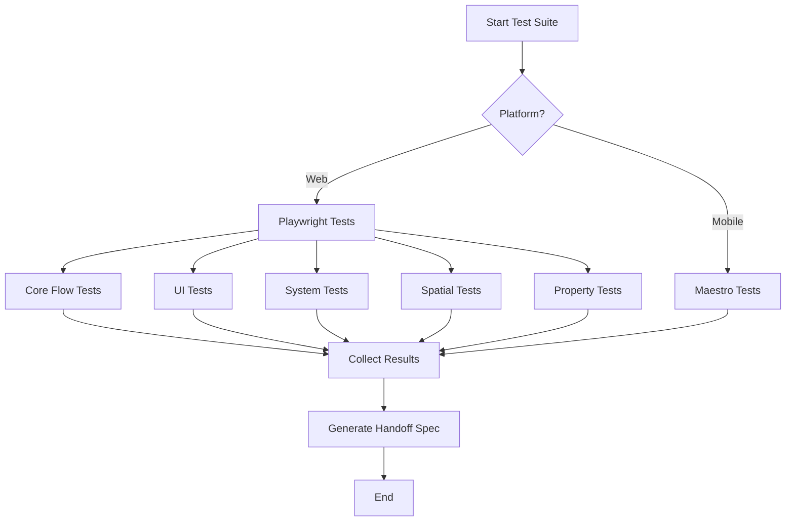
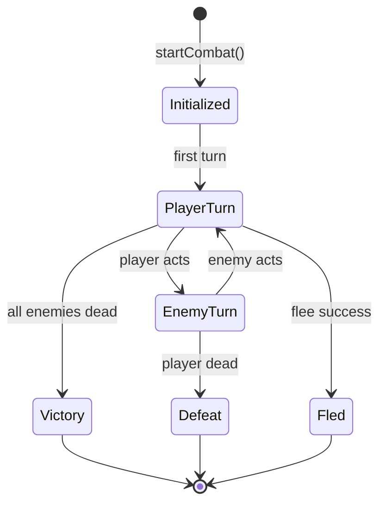
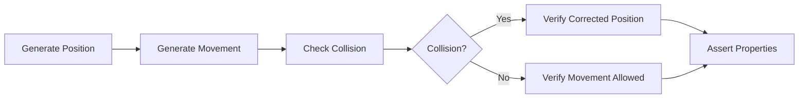

# Design Document: Comprehensive E2E Testing for Iron Frontier

## Overview

This design document outlines the architecture and implementation strategy for a comprehensive end-to-end testing suite for Iron Frontier. The testing framework will use Playwright for web E2E tests and Maestro for mobile E2E tests, leveraging the existing test harness API (`window.__IRON_FRONTIER_TEST__`) to control game state and verify behavior.

The testing suite is organized into logical test modules covering:
1. Core game flow (initialization, phases, transitions)
2. UI panels and HUD components
3. Game systems (inventory, quests, dialogue, combat, shop, travel, survival)
4. Spatial systems (collision, zones, boundaries)
5. Persistence (save/load)
6. Edge cases and error handling
7. Performance and accessibility
8. Mobile-specific tests
9. Handoff specification generation

## Architecture

### Test Framework Stack

```
┌─────────────────────────────────────────────────────────────┐
│                    Test Orchestration                        │
│  ┌─────────────────┐  ┌─────────────────┐  ┌─────────────┐ │
│  │   Playwright    │  │     Maestro     │  │   Jest      │ │
│  │   (Web E2E)     │  │   (Mobile E2E)  │  │   (Unit)    │ │
│  └────────┬────────┘  └────────┬────────┘  └──────┬──────┘ │
└───────────┼─────────────────────┼─────────────────┼─────────┘
            │                     │                 │
┌───────────▼─────────────────────▼─────────────────▼─────────┐
│                    Test Harness API                          │
│  window.__IRON_FRONTIER_TEST__ = {                          │
│    setPhase, startDialogue, openShop, startCombat,          │
│    startPuzzle, setState, addItem, addGold, setTime,        │
│    fastTravel, startQuest, updateObjective, ...             │
│  }                                                           │
└─────────────────────────────────────────────────────────────┘
            │
┌───────────▼─────────────────────────────────────────────────┐
│                    Game Store (Zustand)                      │
│  GameState: phase, playerStats, inventory, quests,          │
│  combatState, dialogueState, travelState, survivalState     │
└─────────────────────────────────────────────────────────────┘
```

### Directory Structure

```
tests/
├── e2e/
│   ├── core/
│   │   ├── initialization.spec.ts
│   │   ├── phase-transitions.spec.ts
│   │   └── new-game-flow.spec.ts
│   ├── ui/
│   │   ├── hud.spec.ts
│   │   ├── action-bar.spec.ts
│   │   ├── panels.spec.ts
│   │   └── responsive.spec.ts
│   ├── systems/
│   │   ├── inventory.spec.ts
│   │   ├── quests.spec.ts
│   │   ├── dialogue.spec.ts
│   │   ├── combat.spec.ts
│   │   ├── combat-edge-cases.spec.ts
│   │   ├── shop.spec.ts
│   │   ├── travel.spec.ts
│   │   └── survival.spec.ts
│   ├── spatial/
│   │   ├── collision.spec.ts
│   │   ├── zones.spec.ts
│   │   └── boundaries.spec.ts
│   ├── persistence/
│   │   └── save-load.spec.ts
│   ├── validation/
│   │   ├── procedural-generation.spec.ts
│   │   └── notifications.spec.ts
│   ├── quality/
│   │   ├── accessibility.spec.ts
│   │   ├── performance.spec.ts
│   │   └── error-handling.spec.ts
│   ├── helpers.ts
│   └── fixtures.ts
├── .maestro/
│   ├── smoke/
│   │   ├── app-launch.yaml
│   │   └── main-menu.yaml
│   ├── flows/
│   │   ├── new-game.yaml
│   │   ├── character-creation.yaml
│   │   ├── basic-gameplay.yaml
│   │   └── panel-smoke.yaml
│   └── config.yaml
└── handoff/
    └── generate-handoff.ts
```

## Components and Interfaces

### Test Harness Interface

```typescript
interface TestHarness {
  // Phase control
  setPhase(phase: GamePhase): void;
  
  // Dialogue
  startDialogue(npcId: string, treeId?: string): void;
  selectDialogueChoice(index: number): void;
  
  // Combat
  startCombat(encounterId: string): void;
  executeCombatAction(action: CombatActionType, targetId?: string): void;
  
  // Shop
  openShop(shopId: string): void;
  buyItem(itemId: string): void;
  sellItem(inventoryId: string): void;
  
  // Puzzle
  startPuzzle(width: number, height: number): void;
  rotatePuzzleTile(x: number, y: number): void;
  
  // State manipulation
  setState(partialState: Partial<GameStateData>): void;
  getState(): GameStateData;
  
  // Inventory
  addItem(itemId: string, quantity?: number): void;
  removeItem(itemId: string, quantity?: number): void;
  
  // Player
  addGold(amount: number): void;
  setPlayerStats(stats: Partial<PlayerStats>): void;
  
  // Time & Survival
  setTime(hour: number, minute: number): void;
  setFatigue(level: number): void;
  setProvisions(food: number, water: number): void;
  
  // Travel
  fastTravel(locationId: string): void;
  
  // Quests
  startQuest(questId: string): void;
  updateObjective(questId: string, objectiveId: string, progress: number): void;
  completeQuest(questId: string): void;
  
  // Collision (for testing)
  checkCollision(from: Point, to: Point, radius: number): CollisionResult;
  getZoneAt(position: Point): Zone | null;
}
```

### Test Helper Functions

```typescript
// tests/e2e/helpers.ts

export async function ensureTitleScreen(page: Page): Promise<void>;
export async function startNewGame(page: Page, playerName?: string): Promise<void>;
export async function callHarness<T>(page: Page, method: string, ...args: any[]): Promise<T>;
export async function waitForPhase(page: Page, phase: GamePhase): Promise<void>;
export async function waitForPanel(page: Page, panelId: string): Promise<void>;
export async function closeAllPanels(page: Page): Promise<void>;
export async function captureScreenshot(page: Page, name: string): Promise<void>;
export async function measurePerformance(page: Page, action: () => Promise<void>): Promise<number>;
```

### Test Fixtures

```typescript
// tests/e2e/fixtures.ts

export const TEST_PLAYER_NAME = 'TestOutlaw';
export const TEST_SEED = 12345;

export const MOCK_INVENTORY_ITEMS = [
  { itemId: 'bandages', quantity: 5 },
  { itemId: 'revolver', quantity: 1 },
  { itemId: 'brass_screws', quantity: 10 },
];

export const MOCK_PLAYER_STATS: PlayerStats = {
  health: 100,
  maxHealth: 100,
  stamina: 100,
  maxStamina: 100,
  xp: 0,
  xpToNext: 100,
  level: 1,
  gold: 50,
  ivrcScript: 0,
  reputation: 0,
};

export const COMBAT_ENCOUNTERS = {
  easy: 'roadside_bandits',
  medium: 'mine_raiders',
  hard: 'boss_encounter',
};

export const SHOP_IDS = {
  general: 'general_store',
  blacksmith: 'blacksmith_shop',
};
```

## Data Models

### Test Result Model

```typescript
interface TestResult {
  id: string;
  name: string;
  suite: string;
  status: 'passed' | 'failed' | 'skipped';
  duration: number;
  error?: {
    message: string;
    stack: string;
    screenshot?: string;
  };
  metadata: {
    requirement: string;
    acceptanceCriteria: string;
    viewport?: string;
  };
}
```

### Handoff Specification Model

```typescript
interface HandoffSpecification {
  generatedAt: string;
  testSummary: {
    total: number;
    passed: number;
    failed: number;
    skipped: number;
    duration: number;
  };
  testResults: TestResult[];
  archaeologyAssessment: {
    codebaseHealth: 'good' | 'moderate' | 'poor';
    technicalDebt: string[];
    architectureNotes: string[];
  };
  featureCompletion: {
    feature: string;
    status: 'complete' | 'partial' | 'missing';
    coverage: number;
    notes: string;
  }[];
  discoveredIssues: {
    id: string;
    severity: 'critical' | 'high' | 'medium' | 'low';
    title: string;
    description: string;
    reproductionSteps: string[];
    affectedRequirement: string;
    suggestedFix?: string;
  }[];
  prioritizedResolutionPlan: {
    priority: number;
    issueId: string;
    estimatedEffort: string;
    dependencies: string[];
  }[];
}
```

### Collision Test Model

```typescript
interface CollisionTestCase {
  name: string;
  from: { x: number; z: number };
  to: { x: number; z: number };
  playerRadius: number;
  expectedCollision: boolean;
  expectedCorrectedPosition?: { x: number; z: number };
  colliderType?: 'building' | 'npc' | 'terrain' | 'trigger';
}
```

### Zone Test Model

```typescript
interface ZoneTestCase {
  name: string;
  position: { x: number; z: number };
  expectedZoneId: string | null;
  expectedZoneType?: ZoneType;
  expectedEncountersEnabled?: boolean;
}
```


## Correctness Properties

*A property is a characteristic or behavior that should hold true across all valid executions of a system—essentially, a formal statement about what the system should do. Properties serve as the bridge between human-readable specifications and machine-verifiable correctness guarantees.*

Based on the prework analysis, the following correctness properties have been identified for property-based testing:

### Property 1: Phase Transition State Integrity

*For any* sequence of valid game phase transitions, the game state SHALL remain consistent and no data corruption SHALL occur.

**Validates: Requirements 3.7**

### Property 2: Character Name Validation

*For any* string of 1-20 alphanumeric characters, the character creation system SHALL accept the name and allow game progression.

**Validates: Requirements 2.2**

### Property 3: Time Display Formatting

*For any* hour value from 0-23, the time display SHALL correctly format the time in 12-hour AM/PM format.

**Validates: Requirements 4.2**

### Property 4: Inventory Operation Consistency

*For any* sequence of inventory operations (add, remove, use, equip, unequip), the total item count SHALL remain consistent with the operations performed.

**Validates: Requirements 5.7**

### Property 5: Quest State Machine Correctness

*For any* quest, starting the quest SHALL add it to active quests, completing objectives SHALL update progress, and completing all objectives SHALL advance the quest stage.

**Validates: Requirements 6.1, 6.2, 6.3, 6.4, 6.5**

### Property 6: Dialogue Tree Traversal Correctness

*For any* dialogue tree and any sequence of valid choice selections, the dialogue SHALL advance to the correct nodes and apply all specified effects.

**Validates: Requirements 7.1, 7.2, 7.3, 7.4, 7.5, 7.6**

### Property 7: Combat Damage Calculation Correctness

*For any* attack with attack power A and defender defense D, the damage dealt SHALL be max(1, A - D * 0.5) with appropriate modifiers, and hit chance SHALL be clamped between 5% and 95%.

**Validates: Requirements 8.2, 9.1, 9.2, 9.3, 9.4**

### Property 8: Combat State Machine Correctness

*For any* combat encounter, when all enemies are defeated the phase SHALL transition to victory, when the player dies the phase SHALL transition to defeat, and dead combatants SHALL be removed from turn order.

**Validates: Requirements 8.5, 8.6, 8.7, 8.8, 8.9**

### Property 9: Shop Transaction Consistency

*For any* sequence of buy and sell transactions, the player's gold and inventory SHALL remain consistent with the transactions performed.

**Validates: Requirements 10.6**

### Property 10: Travel State Management

*For any* travel action, initiating travel SHALL show the destination, completing travel SHALL update location, and cancelling travel SHALL preserve the original location.

**Validates: Requirements 11.1, 11.2, 11.3, 11.5, 11.6**

### Property 11: Survival System Integration

*For any* time advancement, the time display SHALL update, fatigue SHALL increase appropriately, and provisions SHALL be consumed according to activity.

**Validates: Requirements 12.1, 12.2, 12.3, 12.5, 12.6**

### Property 12: Collision Detection Correctness

*For any* movement from point A to point B with player radius R, if the path intersects a collider, the collision system SHALL detect it and provide a corrected position.

**Validates: Requirements 13.1, 13.2, 13.3, 13.4, 13.5**

### Property 13: Zone Management Correctness

*For any* player position, the zone system SHALL correctly identify the active zone based on priority, and zone transitions SHALL use the correct spawn positions.

**Validates: Requirements 14.1, 14.2, 14.3, 14.4, 14.5, 14.6**

### Property 14: Boundary Enforcement

*For any* position at or beyond world boundaries, the collision system SHALL prevent movement outside valid bounds.

**Validates: Requirements 15.1, 15.5**

### Property 15: Save/Load Round-Trip Consistency

*For any* game state, saving and then loading SHALL restore the exact same state including player position, stats, inventory, and quest progress.

**Validates: Requirements 16.1, 16.2, 16.5**

### Property 16: Puzzle State Management

*For any* puzzle, rotating tiles SHALL update state correctly, and solving the puzzle SHALL be detected and grant rewards.

**Validates: Requirements 17.1, 17.2, 17.3, 17.4**

### Property 17: Procedural Generation Determinism

*For any* seed value, generating content with that seed SHALL produce identical output every time.

**Validates: Requirements 18.5**

### Property 18: Notification Lifecycle

*For any* game event that triggers a notification, the notification SHALL appear and eventually expire according to its type.

**Validates: Requirements 19.1, 19.2, 19.3, 19.4, 19.5**

### Property 19: Responsive UI Adaptation

*For any* viewport size, the UI SHALL adapt to display all interactive elements with minimum 44px touch targets.

**Validates: Requirements 20.1, 20.2, 20.3, 20.4, 20.5**

### Property 20: Accessibility Compliance

*For any* interactive element, ARIA labels SHALL be present and keyboard navigation SHALL be functional.

**Validates: Requirements 21.1, 21.2, 21.3, 21.4, 21.5**

## Error Handling

### Test Failure Handling

```typescript
interface TestFailureHandler {
  // Capture screenshot on failure
  captureFailureScreenshot(page: Page, testName: string): Promise<string>;
  
  // Capture game state on failure
  captureGameState(page: Page): Promise<GameStateData>;
  
  // Log failure details
  logFailure(result: TestResult): void;
  
  // Retry flaky tests
  retryTest(test: () => Promise<void>, maxRetries: number): Promise<boolean>;
}
```

### Error Categories

1. **Assertion Failures**: Test expectations not met
   - Capture screenshot and game state
   - Log expected vs actual values
   - Continue with remaining tests

2. **Timeout Failures**: Elements not found within timeout
   - Increase timeout and retry once
   - Capture screenshot of current state
   - Log element selector that failed

3. **Crash Failures**: Application crashes during test
   - Capture error logs
   - Restart application
   - Mark test as failed with crash indicator

4. **Network Failures**: API or resource loading failures
   - Retry with exponential backoff
   - Log network error details
   - Mark as infrastructure failure if persistent

### Recovery Strategies

```typescript
async function withRecovery<T>(
  action: () => Promise<T>,
  recovery: () => Promise<void>,
  maxAttempts: number = 3
): Promise<T> {
  for (let attempt = 1; attempt <= maxAttempts; attempt++) {
    try {
      return await action();
    } catch (error) {
      if (attempt === maxAttempts) throw error;
      await recovery();
    }
  }
  throw new Error('Max attempts exceeded');
}
```

## Testing Strategy

### Dual Testing Approach

The testing strategy employs both unit tests and property-based tests:

- **Unit tests**: Verify specific examples, edge cases, and error conditions
- **Property tests**: Verify universal properties across all inputs

### Test Organization

```
Test Suites:
├── Core Flow Tests (Playwright)
│   ├── Initialization tests
│   ├── Phase transition tests
│   └── New game flow tests
├── UI Tests (Playwright)
│   ├── HUD tests
│   ├── Panel tests
│   └── Responsive tests
├── System Tests (Playwright)
│   ├── Inventory tests
│   ├── Quest tests
│   ├── Combat tests
│   └── ... (all game systems)
├── Spatial Tests (Playwright + Unit)
│   ├── Collision tests
│   ├── Zone tests
│   └── Boundary tests
├── Property Tests (fast-check)
│   ├── State integrity properties
│   ├── Calculation properties
│   └── Round-trip properties
└── Mobile Tests (Maestro)
    ├── Smoke tests
    └── Flow tests
```

### Property-Based Testing Configuration

The test suite will use `fast-check` for property-based testing with the following configuration:

```typescript
import fc from 'fast-check';

// Minimum 100 iterations per property test
const PBT_CONFIG = {
  numRuns: 100,
  verbose: true,
  seed: 12345, // Reproducible tests
};

// Example property test
describe('Property Tests', () => {
  it('Property 17: Procedural Generation Determinism', () => {
    fc.assert(
      fc.property(fc.integer({ min: 1, max: 999999 }), (seed) => {
        const result1 = generateWorld(seed);
        const result2 = generateWorld(seed);
        return deepEqual(result1, result2);
      }),
      PBT_CONFIG
    );
  });
});
```

### Test Tagging

Each test will be tagged with:
- **Feature**: The feature being tested (e.g., `comprehensive-e2e-testing`)
- **Property**: The property number if applicable
- **Requirement**: The requirement being validated

```typescript
test('Combat damage calculation', {
  tag: ['Feature: comprehensive-e2e-testing', 'Property 7: Combat Damage Calculation Correctness'],
}, async ({ page }) => {
  // Test implementation
});
```

### Coverage Goals

| Category | Target Coverage |
|----------|-----------------|
| Core Flow | 100% |
| UI Panels | 100% |
| Game Systems | 95%+ |
| Collision/Zones | 95%+ |
| Edge Cases | 90%+ |
| Mobile | 80%+ |

### Handoff Specification Generation

The final task will generate a comprehensive handoff specification including:

1. **Test Results Summary**: Pass/fail counts, duration, coverage
2. **Archaeology Assessment**: Code health, technical debt, architecture notes
3. **Feature Completion Matrix**: Status of each game system
4. **Issue Registry**: All discovered issues with severity and reproduction steps
5. **Resolution Plan**: Prioritized list of fixes with effort estimates

```typescript
// handoff/generate-handoff.ts
async function generateHandoffSpec(
  testResults: TestResult[],
  codebaseAnalysis: CodebaseAnalysis
): Promise<HandoffSpecification> {
  return {
    generatedAt: new Date().toISOString(),
    testSummary: summarizeResults(testResults),
    testResults,
    archaeologyAssessment: analyzeCodebase(codebaseAnalysis),
    featureCompletion: assessFeatures(testResults),
    discoveredIssues: extractIssues(testResults),
    prioritizedResolutionPlan: prioritizeIssues(testResults),
  };
}
```

## Mermaid Diagrams

### Test Execution Flow



### Combat Test State Machine



### Collision Detection Test Flow


